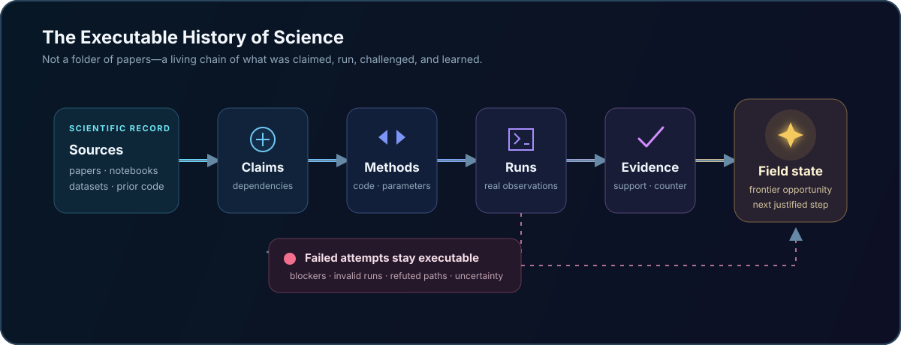
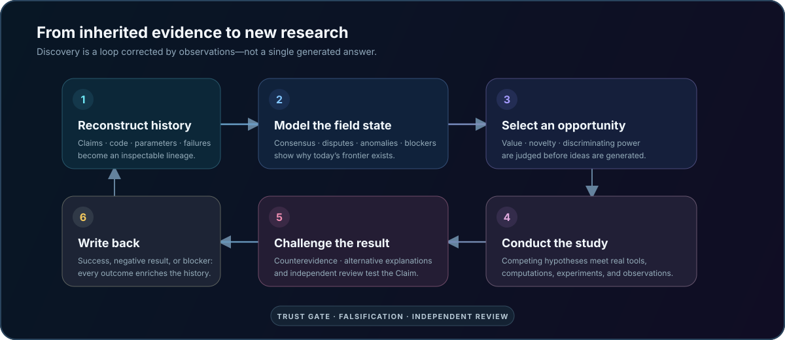
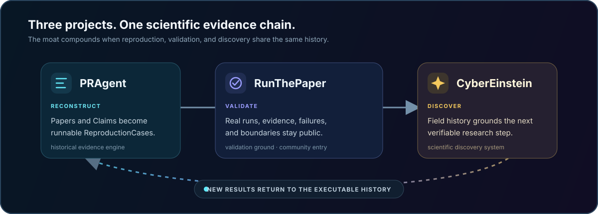
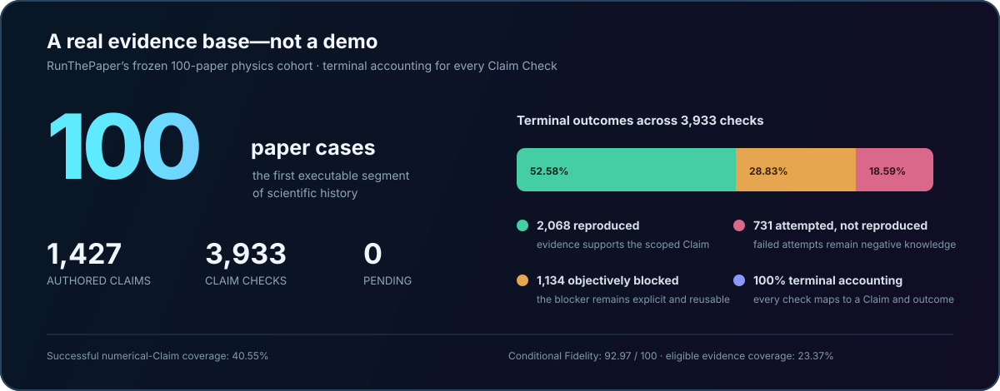

<p align="center">
  
</p>

<h1 align="center">CyberEinstein</h1>

<p align="center">
  <strong>Executable History of Science · 可执行科学史</strong><br />
  继承科学走过的每一步，才更有机会走出下一步。<br />
  一个证据原生的 AI 科学家系统：把学科的 Claim、代码、运行、证据与失败历史，变成下一项可验证研究的起点。
</p>

<p align="center">
  <a href="README.md">English</a> ·
  <strong>简体中文</strong>
</p>

<p align="center">
  <a href="LICENSE"></a>
</p>

<p align="center">
  <a href="#ai-可以生成-idea科学更需要记忆">为什么需要它</a> ·
  <a href="#谁会使用-cybereinstein">谁会使用</a> ·
  <a href="#从历史走向发现">如何研究</a> ·
  <a href="#100-篇论文不是奖杯而是起点">检查公开证据</a> ·
  <a href="#开发者快速开始">在本地运行</a>
</p>

> **科学发现，不应该从一个空白提示词开始。**

<p align="center">
  
</p>

## AI 可以生成 Idea，科学更需要记忆

AI 已经可以阅读最新论文、生成假设、编写代码，甚至完成一篇看起来完整的研究报告。但科研不是从几篇摘要跳到一个新 Idea，也不是让 Agent 宣布“实验成功”。

每个真正值得研究的问题都有来路：前人建立过什么、哪些代码真正跑通、哪些实验失败、哪些假设被反驳、哪些异常仍未解释，以及过去的阻塞条件今天是否已经消失。

如果 AI 不继承这些历史，它产生的新 Idea 很容易成为无根之木：重复旧问题，踩进已知错误，或者把实现偏差误认为科学发现。

CyberEinstein 的起点不是一个空白 Prompt，而是一个学科已经走过的完整证据历史。

> 大多数 AI 科研工作流只把历史当成生成一次答案时的临时上下文；CyberEinstein 要把它变成每一项后续研究都能继承的、持久而可执行的科研基础设施。

## 可执行科学史

**Executable History of Science** 不是论文数据库，也不是普通知识图谱。它试图保存科学知识是怎样产生、失败、修正和继续发展的。

<p align="center">
  
</p>

| 普通文献上下文 | 可执行科学史 |
| --- | --- |
| 论文说了什么 | 结论是怎样被建立和修正的 |
| 引用和摘要 | Claim、证据、反证与依赖关系 |
| 最终代码 | 正确代码、参数、环境与真实运行 |
| 成功结果 | 成功、受阻、无效和错误尝试 |
| 一次问答的上下文 | 跨人员、Agent 和项目持续生长的科研记忆 |

这让 CyberEinstein 不只是知道人类目前知道什么，还能理解：我们为什么相信它、在哪里失败过、科学为什么走到今天，以及下一步最值得往哪里走。

## 谁会使用 CyberEinstein

CyberEinstein 面向手里有真实开放问题、能够判断科学有效性，并且需要 AI 留下持久证据链的研究者——而不是只想得到一段听起来合理的答案的人。

| 使用者 | 他们带来的问题 |
| --- | --- |
| 研究负责人或 PI | 下一项研究是否值得投入团队时间、算力和经费？ |
| 博士后、博士生或科研人员 | 哪些结论真正成立、哪些路径已经失败、下一步应该验证什么？ |
| 科研软件工程师或 AI4S 团队 | 怎样把代码、运行、审查和负结果变成可复用的科研基础设施？ |
| 科研院所或研发组织 | 能否私有化部署、更换模型、连接内部工具，同时审计每个结论？ |

第一阶段从量子计算、量子信息、多体物理、非厄米物理和相邻计算物理方向切入。这不是 CyberEinstein 的学科边界，而是我们拥有领域判断、历史案例和可执行工具的第一块研究阵地。

典型用户不是来问“给我十个新 Idea”，而是带着这样的任务：

> 这个问题过去为什么没有解决？哪些路径已经失败？现在什么条件发生了变化？下一项最能区分竞争解释的计算或实验是什么？

## 从历史走向发现

科学发现不是一次生成，而是一个不断被 observation 修正的过程。CyberEinstein 的完整研究闭环是：

<p align="center">
  
</p>

### 1. 重建历史

把领域论文、Claim、代码、参数、运行、证据、反证、审查和失败经验连接起来，形成可检查、可执行的研究谱系。

### 2. 理解学科状态

区分稳定共识、竞争解释、证据薄弱的流行结论、历史阻塞、异常现象、已经走不通的路径和正在形成的新 Topic。

### 3. 判断前沿机会

不急着生成 Idea，而是先判断哪个问题兼具科学价值、新颖性、区分能力、可执行性和潜在影响，并明确成本、风险与验证条件。

### 4. 开展原创研究

基于历史上已经验证的代码和方法提出竞争假设，设计能够区分它们的计算或实验，调用真实工具执行，再根据 observation 修正下一步。

### 5. 主动寻找反证

发现 Agent 负责推进假设，独立验证过程负责寻找反例、替代解释和实现错误。Agent 完成任务不等于科学结论成立。

### 6. 把结果写回历史

无论得到候选新 Claim、负结果还是客观阻塞，都保留完整依据，让下一位研究者和下一次 Agent 运行不必从头开始。

CyberEinstein 最终交付的不是一段对话或一篇自动生成的论文，而是一项可以检查、反驳、复现和继续推进的研究。

## 三个项目，一条科研证据链

<p align="center">
  
</p>

| 项目 | 角色 | 核心产出 |
| --- | --- | --- |
| [PRAgent](https://github.com/xi-zhao/PRAgent) | 历史证据生产引擎 | 把论文和 Claim 变成可运行、可检查的 `ReproductionCase` |
| [RunThePaper](https://github.com/xi-zhao/RunThePaper) | 公开验证场与社区入口 | 展示真实运行、成功证据、失败尝试和剩余边界 |
| **CyberEinstein** | 科学发现系统 | 继承学科历史，选择下一步研究，并产生新的可验证证据 |

PRAgent 不是 CyberEinstein 的最终定位。它让 CE 有能力理解已知科学，而不是在不知道历史是否可靠的情况下直接生成新结论。

## 100 篇论文不是奖杯，而是起点

[RunThePaper](https://github.com/xi-zhao/RunThePaper) 已经公开 100 篇物理论文复现案例，并完成固定分母的 [Claim-first 100 篇审计](https://github.com/xi-zhao/RunThePaper/tree/main/evaluation/claim-first-100)。这批案例开始构成 CyberEinstein 的第一段可执行科学史。

<p align="center">
  
</p>

| 公开证据 | 审计结果 |
| --- | ---: |
| 论文案例 | 100 |
| 论文原始 Claims | 1,427 |
| Claim Checks | 3,933 |
| 已复现 Checks | 2,068 |
| 客观受阻 Checks | 1,134 |
| 已尝试但未复现 Checks | 731 |
| 尚未归档 Checks | 0 |

按每个数值 Claim 等权计算，成功覆盖率为 **40.55%**。在具有合格科学区域证据的成功 Claim 上，条件 Fidelity 为 **92.97/100**，对应的证据覆盖成功 Claim 质量的 **23.37%**。

这不代表“一百篇论文全部复现成功”。它代表所有 3,933 个 Checks 都有直接 Claim 映射和终态，成功、客观阻塞和真实失败都没有从历史中消失。

对于 CyberEinstein，错误尝试不是需要清理的噪声，而是阻止未来研究重复踩坑的负知识。

## 为什么这套壁垒会持续复利

可执行科学史是核心资产，但它不是孤立的单点功能。随着历史增长，CyberEinstein 的七层能力会相互增强：

| 层次 | CyberEinstein 积累什么 | 给研究者带来什么 |
| --- | --- | --- |
| 数据 | 可执行科学史、正确代码、证据和失败历史 | 不再从论文摘要和空白代码开始 |
| 认知 | 持续更新的学科状态模型 | 看清共识、争议、异常和真正前沿 |
| 决策 | 有历史依据的研究机会判断 | 把资源投入最值得验证的下一步 |
| 执行 | 领域工具、科学计算、模拟器和未来仪器接口 | 把假设变成真实 observation |
| 可信 | Claim-first、反证、独立审查和外部复现 | 知道一个结论为什么值得相信 |
| 网络 | 研究者、课题组、审查者和工具开发者 | 让一次贡献改善整个领域的科研记忆 |
| 开放生态 | 可检查规则、共享协议、可替换模型与本地部署 | 不被黑盒系统和单一模型锁定 |

真正难以复制的不是某个 Agent 工作流，而是这个不断复利的循环：

```text
更多历史复现
→ 更准确的学科状态
→ 更好的前沿机会
→ 更可信的新研究
→ 更多成功、失败和审查证据
→ 更完整的可执行科学史
```

## 开放，不只是公开代码

CyberEinstein 的目标是开放代码，也开放科研协作所需的核心协议：`Claim`、`Evidence`、`ReproductionCase`、`FailureLesson`、学科状态、研究机会和未来的 `DiscoveryCase`。

开放让研究者能够检查结论如何产生，在本地连接私有数据、算力和工具，为新学科增加能力，并通过复现、纠错和独立审查共同扩展可执行科学史。

CyberEinstein 采用 [Apache License 2.0](LICENSE) 正式开源。它宽松的使用条款和明确的专利授权，有利于开放协议、社区贡献、领域插件、商业采用和自托管部署共同形成 CyberEinstein 持续增长的综合壁垒。

## 当前实现与下一步

我们把已经存在的基础与尚未完成的产品能力明确分开。

| 状态 | 能力 |
| --- | --- |
| 已实现 | 官方 `@deepseek-ai/dsh@0.1.1-rc.2` Agent、Session、权限、Web 与 Cordis 插件底座 |
| 已实现 | 受限论文发现与获准全文读取适配器 |
| 已实现 | 记录证据、反证、矛盾、缺口和停止理由的 Deep Literature Research |
| 已实现 | 持久化、版本化 `ReproductionCase` 及其证据、并发和独立审查规则 |
| 正在建设 | 将 RunThePaper 与 PRAgent 资产转化为跨论文、跨项目的可执行科学史 |
| 正在建设 | 学科状态、前沿机会、竞争假设和 `DiscoveryCase` 领域模型 |
| 长期方向 | 科学发现闭环、跨课题学习，以及在明确授权下连接真实实验 observation 与仪器 |

CyberEinstein 今天还不是一个已经完成的自主科学家。当前仓库正在建立它最难替代的基础：让科研历史、证据和失败能够被 Agent 真正继承。

## 不变的科学规则

- 每个新 Claim 都必须连接历史依据、运行证据、反证和不确定性。
- 计算或实验结果必须追溯到代码、环境、参数、输入和 observation。
- 新颖性必须说明相对已有 Claim 的真实增量，而不是依赖模型自述。
- 发现过程与反证、独立审查过程保持分离。
- 受阻、负结果和无效运行都是科研历史的一部分。
- 发表、外部写入、昂贵计算和真实设备控制必须经过人类授权。
- 降低科研门槛不能以降低证据、复现和审查标准为代价。

详细产品边界见 [发展愿景](docs/development-vision.md) 与 [架构原则](docs/architecture.md)。

## 开发者快速开始

### 环境要求

- Node.js 24 或更高版本（也支持 22.19+）
- Corepack / pnpm
- Python 3.11–3.14 和 [uv](https://docs.astral.sh/uv/)

### 安装与验证

```bash
git clone https://github.com/xi-zhao/CyberEinstein.git
cd CyberEinstein
corepack pnpm install
corepack pnpm setup
corepack pnpm test
```

静态检查无需 API Key。运行真实模型任务前：

```bash
cp .env.example .env
# 编辑 .env，填入 DEEPSEEK_API_KEY
corepack pnpm dsh:web
```

工作台默认启动于 `http://127.0.0.1:3080`。也可以单独检查各项基础能力：

```bash
corepack pnpm pragent:sources:check
corepack pnpm deep-research:check
corepack pnpm dsh:headless -- "重建这个研究方向的历史证据和当前争议"
```

实现说明：

- [PRAgent 来源集成](docs/pragent-source-integrations.md)
- [Deep Literature Research](docs/deep-literature-research.md)
- [ReproductionCase 领域服务](docs/reproduction-case.md)
- [DeepSeek Harness 底座](docs/harness-integration.md)

## 从这里开始

如果你手里有一个真正值得研究的问题，不要让 AI 从空白提示词开始。

- 查看 [RunThePaper 的 100 篇公开案例](https://github.com/xi-zhao/RunThePaper#paper-reproduction-catalog)，了解现有证据怎样进入历史；
- 在本地运行 CyberEinstein，检查科研对象、证据规则和 Agent 基础；
- 带着一个研究方向、一段正确代码、一次失败尝试或一种更可靠的验证方法，[参与讨论](https://github.com/xi-zhao/CyberEinstein/issues/new)。

<p align="center">
  <strong>继承科学走过的每一步，才更有机会走出下一步。</strong><br />
  <sub>可执行科学史 · 为开放而设计 · 为可验证发现而构建</sub>
</p>
